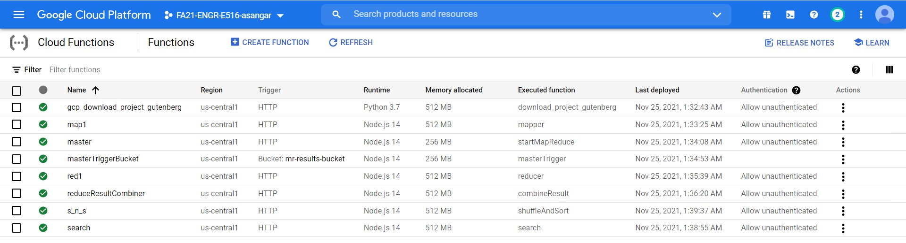
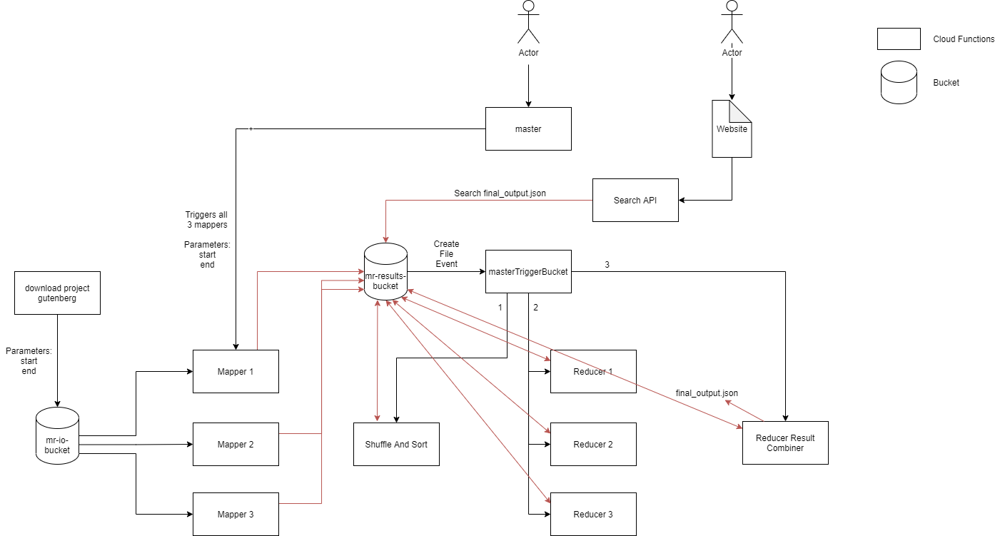

# Map-Reduce-with-Cloud-Functions

The task is to design and implement a **parallel** Map-Reduce system using Google Cloud Functions (Functions as a Service)

A simple text-search engine is implemented by computing an inverted index of a large text corpus using the general Map-Reduce design principle, and exposing a simple web-based search interface.

# Data Source
- Files from Project Gutenberg

# How to run
1. Run deployment script 

    **sh deploy_bucket_functions.sh**

    This script will create 2 buckets and 8 cloud functions.

    
    
    ----
    
2.  Copy search api
    
    Copy the trigger command of ‘search’ cloud function and paste it into the first line of the <script> tag (line 121) inside index.html of search-engine-website folder
    
    var searchURL = "https://zone-project.cloudfunctions.net";
    
    ----
    
3. Run website deployment script inside ‘search-engine-website’ folder

    **sh deploy_website.sh**

    Enter information when prompted. 

# **Data loading script**: 
    
  Run trigger URL for the “gcp_download_project_gutenberg” cloud function with the mentioned query parameters –

  **Parameters** –
  - bucket_name=mr-io-bucket

  - start=[integer_no]

  - end=[integer_no]

    Start and end denotes the file range that will be downloaded [START,END)

   
  Example – 
  https://zone-project.cloudfunctions.net/gcp_download_project_gutenberg?bucket_name=mr-io-bucket&start=100&end=120

  This will download files from project Gutenberg and store it in mr-io-bucket.

  **Result** – You can see the files downloaded inside mr-io-bucket. There’s also a mapping file(mr-file-mappings.txt) for keeping track of filenames and their URLs.
    
    
# Execution 
Run trigger URL for the "master" cloud function with the mentioned query parameters
    
  **Parameters** –
  - start=[integer_no]

  - end=[integer_no]
    Start and end denotes the file range that will be downloaded [START,END)

   
  Example – 
  https://zone-project.cloudfunctions.net/master?start=100&end=115

  This will start the map-reduce operation and the results of each step can be seen by monitoring the mr-results-bucket.

  **Result** - Finally, you will get the inverted indexes for documents inside **final_output.json** file.
    
    
# Streaming Search
    
  map1 cloud function can be used to update indexes inside the final_output.json. The same implementation can be used to address new documents as they are added to the corpus by changing the trigger type from http to bucket add/modify.

  **Parameters** –
  - start=[integer_no]

  - end=[integer_no]

  - update=true

  Start and end denotes the file range that will be downloaded [START,END)

   
  
  **update** flag is used for appending results to final_output.json

  Example – 
  https://zone-project-asangar.cloudfunctions.net/map1?start=115&end=117&mapper_no=1&update=true

   

  **Flow** –

  Mapper1 -> Reducer1 -> Reducer Result Combiner -> Update file in bucket

  Mapper1 Output - reducer1_input_update.json

  Reducer1 Output - reducer1_output_update.json

  Reducer Result Combiner – Combines ‘reducer1_output_update.json’ and ‘final_output.json’ and saves as ‘final_output.json’
    
# Architecture

  
  
# Cost Estimation
    
  The functions like master and masterTriggerBucket are only used to invoke other functions and thus runs for a very little time. Since they are 256MB machines, the cost to operate is $0.000000648/100ms. 

  The cost to run other 512MB cloud function is $0.000001295/100ms. The major cost will be generated from functions like mappers, reducers, shuffleAndSort and reduceResultCombiner as these are major running functions.

  The search function although runs for a short time, it will also contribute greatly to the cost because of the huge number of invocations by different frontend websites.

  Since all these functions are deployed in the same region, the networking cost i.e., inbound and outbound data to operate multiple functions is free.

    
# Web search
    
  Type in the search box and wait for results.

  

  
    
    
